# Azerbaijan

The **_Republic of Azerbaijan_** is a country that lies in the crossroads of Eastern Europe and Western Asia. In this project, this country will be described in the following aspects: **political subdivisions** and **population distribution**. In addition, two administrative subdivisions--**_Lankaran District_** and **_Lankaran City_** will be examined in **population distribution**, **distributions of human settlements**, and its relation to **road networks** and **healthcare facilities**.

## Political Subdivisons

Azerbaijan has 10 **first level administrative subdivisons** (adm1) and 79 **second level administrative subdivisons** (adm2), and the adm2s **_Lankaran District_** and **_Lankaran City_** are located in the Southeast Corner of _Lankaran_ (adm1), which also lies in the Southeast of the country, on the West coast of Caspian Sea and bordering Iran, as is shown in the following plots:

###### (Note that in this plot and following desription the adm2 **_Lankaran District_** will be simplified as **_Lankaran_**.)

It is worth mentioning that **_Lankaran_** consists of 2 parts, with penisulas and islands in the East, whose boundaries are incorporated into the the adm2 boundary, and **_Lankaran City_** locates in the trapzoidal "gulf" on the Eastern boundary in the Southern part:

In general, the administrative subdivisons of Azerbaijan are normally distributed, except for the _Nakhchivan Autonomous Republic of Azerbaijan_ (_Nakhchivan_ in the plot) in the southwest, which is isolated from all other parts of the country due to conflicts in history with Armenia.

## Population (Azerbaijan)

### Population and Distribution

According to data from _Humanitarian Data Exchange_ (HDX), the total population of Azerbaijan in **2019** (pop19) is 10,115,498 (about 10.12 million). And population distribution on adm2 level is presented in the following plot:

The 3-dimensional versions of the plot:

The population comparison on adm1 level and the the share of population of adm2s within each adm1:

Based on these plots, it can be observed that the population in almost all adm2s are rather similar except for in adm1 _Absheron_. There, the population is exceptionally larger and among the four adm2s in the adm1, Baku City--the Capital--has much larger population than any other amd2s. It is reasonable that the capital is the most economically developed area in the country and thus has the largest population, and the large total population in surrounding adm2s could be explained by satellite cities with provide housing urban populations, and the influence and expansion of the urban area and economies in the capital.

All in all, the population distribution of Azerbaijan follows the general trend that populations concentrate in major cities (especially the capital), and spread thin in the vast rural areas.

### Density, Nighttime Lights, and Correlations

On adm1 level, population density and its correaltionship with population can be deduced from the following plots:

Based on the following plots, **density** seems to more or less follow a positive correlation with **population** on the adm1 level, that larger popluation seems to indicate higher density. However, on the adm2 level, the correlation between **density** and **population** seems different:

As can be seen in the overlay of the _histogram_ and the _probability density function_ (pdf) of **density** and the **logarithm of population** (in which case makes the plot more interpretable), the density reaches its maximum long before the log(pop19) does. Such outcome could be caused be the large areas of populous adm2s (such as _Baku City_) or limited areas of the adm2s result in high density with moderate population. Either way, it can be concluded that Azerbaijan shows various patterns of relationship between population and density.

In addition, the correlation between **nighttime light** (NTL) and **population** also provides useful information:

Similarly, **logarithm of population** is used to provide sonsistency and interpratability, and the similar shape of this overlay suggests the positive correlation between **density** and **NTL**. Besideds, this overlay also further confirms the conclusion drawn from the former overlay, that populous adm2s might be generally large, while some adm2s covering smaller areas might produce very high density.

###  Models of Population and Distribution and Validation

To further investigate how population distribution is affected by various conditions, a linear model is used and inputs include various vegetation coverage, urban coverage, topograph, water body, slope, NTL, and so on. The **regression line** and **confidence interval** are shown as follow:

The plot shows a very wide **confidence interval** in the middle, indicating low accuracy. The reason for it is that all dots, except the one representing _Baku City_, cluster on the left side of the plot. Some of them are much higher in the plot than others, causing the **regression line** bowing upward in the middle.

To summarize, the linear model does not seem to able to imply how the variables influence population distribution. Thus, the variables have complicated correlationhips with population distribution and therefore more complex models could be used to diminish the errors. 

Similarly, for the purpose of predicting the population nationwide, linear models are used. However, in this case, three approaches are used: one based on the **sum** of geospatial covariates per adm2 ("Sums"), another on the **mean** ("Means"), and the last one on **mean** as well but use the **logarithm of population** as the response ("Logpop"). It is worth mentioning that in this case population data in **2015** rather than **2019** is used, for the reason that better accuarcy of prediction can be achieved since other covariates are all 2015 data. The results are shown as follows.

"Sums":

"Means":

"Logpop":

After obtaining these plots, they are compared with the real population data. The differences is then calculated.

Difference of "Sums" ("Diffsums"):

The 3-dimentional version:

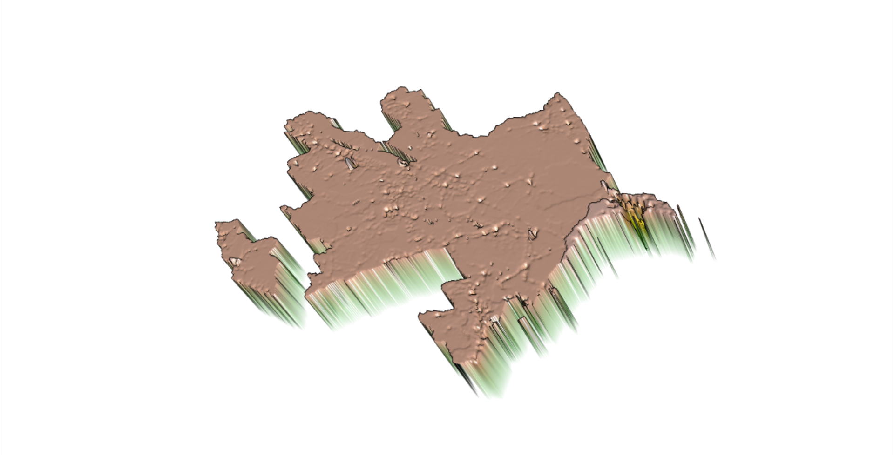

Difference of "Means" ("Diffmeans"):

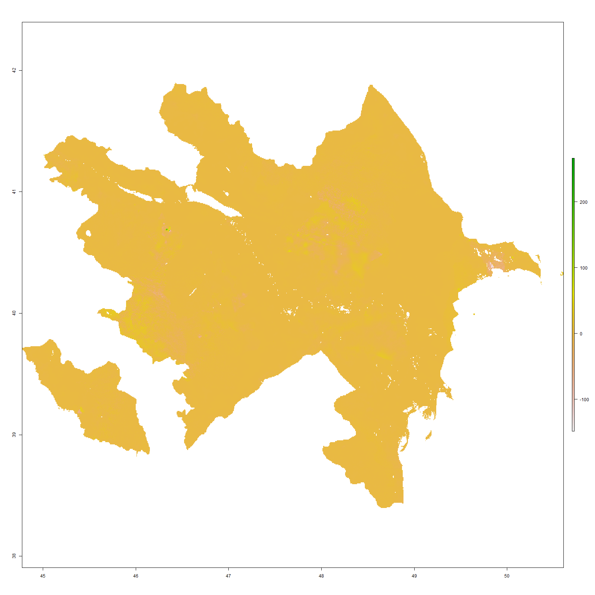

The 3-dimentional version:

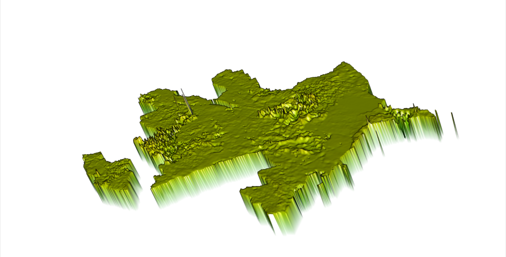

Difference of "Logpop" ("Difflogpop"):

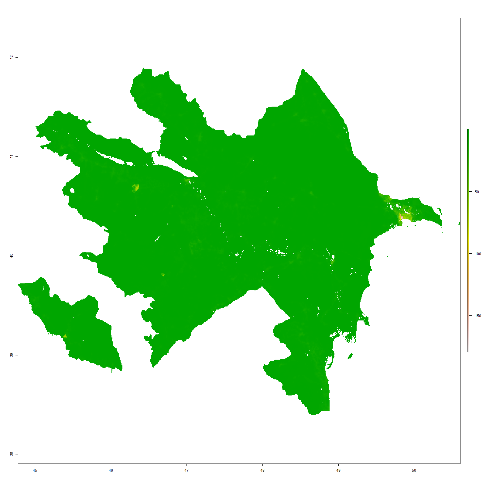

The 3-dimentional version:

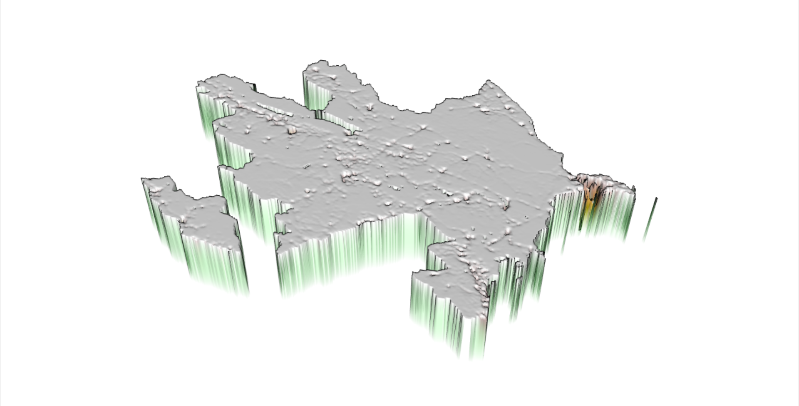

The calculation of the sum of the absolute values of the differences between each model and the acutal pop15:

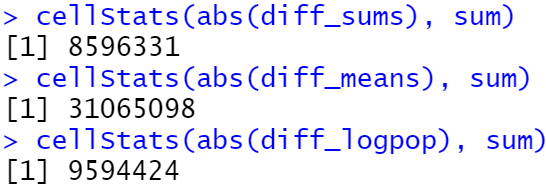

Based on the plots and the calculation, the **"Sums"** model is the least different from the actual population. However, with the total absolute difference up to 8,596,331 (8.60 million), the discrepancy is still definately huge for country with only about 10 million population. 

Therefore, if more sophisticated model, which taking more variations into accout, are employed, the accuracy of prdiction might be improved. 

## Population (_Lankaran_ and _Lankaran City_)

The two Adm2s, based on _HDX_ data, have 216,384 (216 thousand) people in 2019. To specify, the much larger _Lankaran_ has a **population** of 196,655 while _Lankaran City_ has 19,729. As the **area** of _Lankaran_ is about 111.5 times that of _Lankaran City_ (680,504 gridcells to 6097 gridcells), the **population density** in _Lankaran City_ is about 11.2 times that of _Lankaran_. The total populations, distributions, and most populous areas are ilustrated in following plots.

Population and distribution of _Lankaran_:

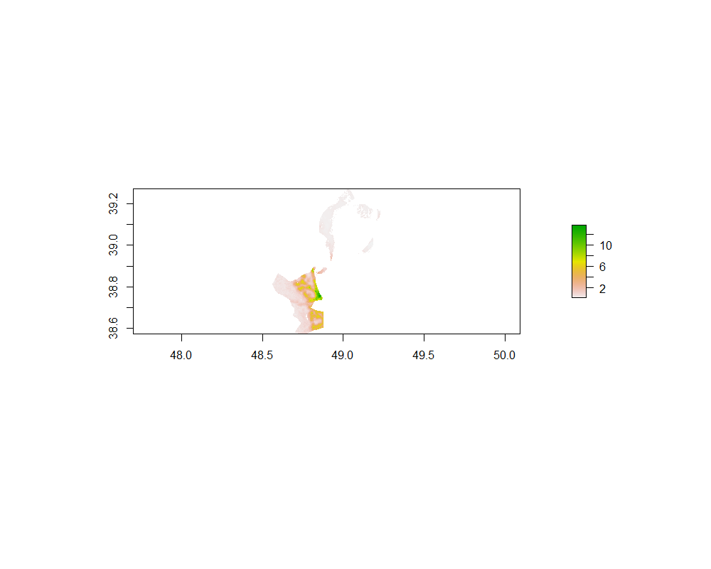

The 3-dimentional version:

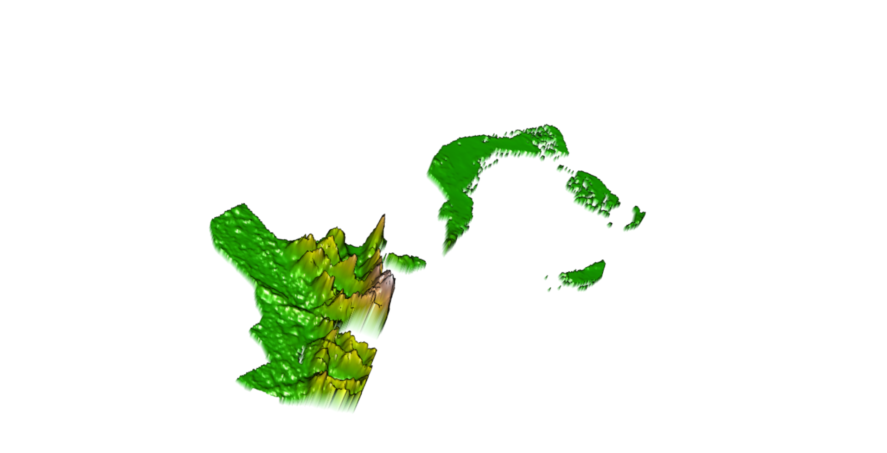

Population and distribution of _Lankaran City_:

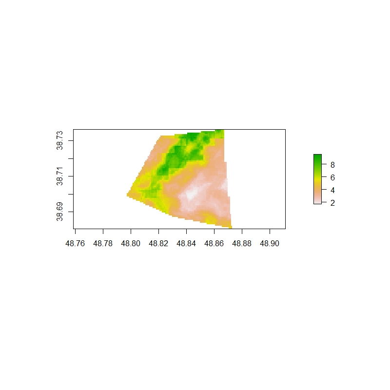

The 3-dimentional version:

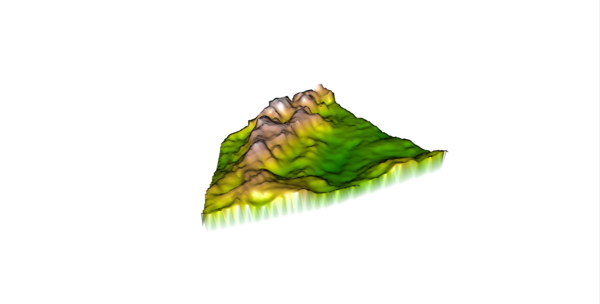

Population distribution of _Lankaran_ (based on satellite image):

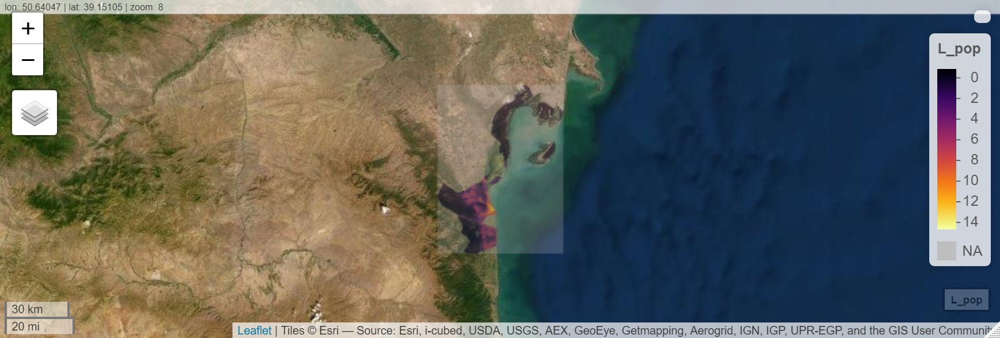

Because the northern part is scarcely populated comparing to the south as well as _Lankaran City_, a foucs on the populous southern part of _Lankaran_ (based on topography) would be more interpretable:

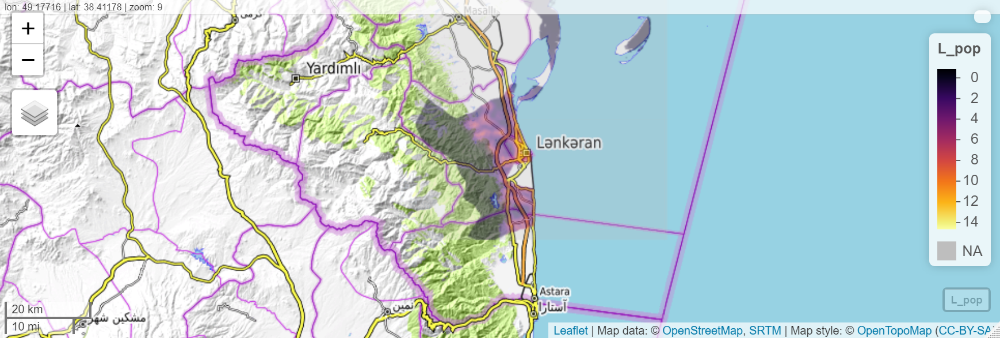

Most populous central urban area of _Lankaran_ (based on the street layout):

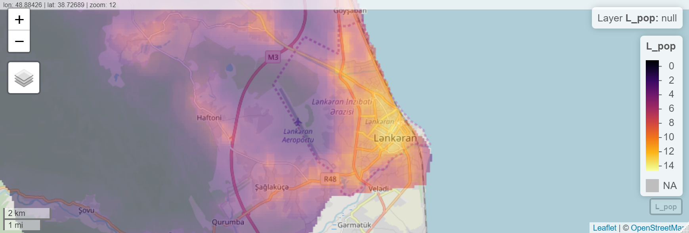

Population distribution of _Lankaran_ (based on topography):

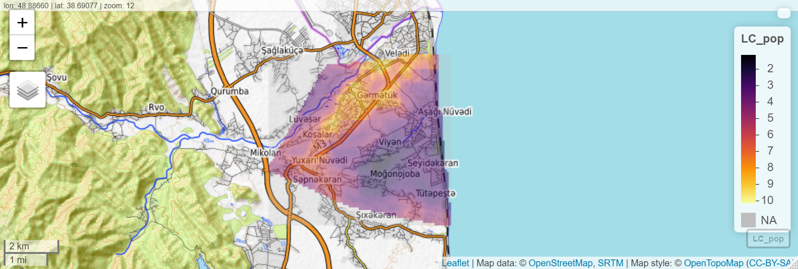

Most populous central urban area of _Lankaran_ (based on the street layout):

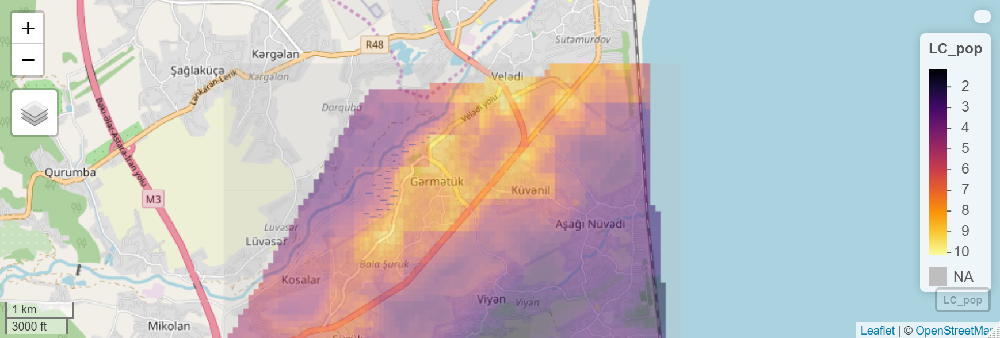

These interpretations of thes plots is consistent with the previous calculations, and indicate the general trend of population distribution, that people are highly concentrated in the coastal area in the southern part, and settlements expand inland.

## Urban areas, Road Network, and Healthcare Facilities and Accessibility (_Lankaran_ and _Lankaran City_).

Based on the understanding of the Population in the area, provided by previous plots, the **urban areas** are defined by two areas with population density over 3,100,000, which cover total areas of about 322.31 suqared kilometers, and consist 93,463 people in total.

There are 265 **roads** in the two adm2s, including 92 primary roads, 71 secondary ones, and 102 tertiary ones. These three types of roads cover a total distance of 367.68 kilometers.

There are 6 **healthcare facilities** in the area based on _HDX_ data (whose error will be indentified), including 2 hospitals (108,192 people per site on average), 3 pharmacies, 1 “doctors” (possibly clinic).

With all these information, the following 3-dimensional plots are produced:

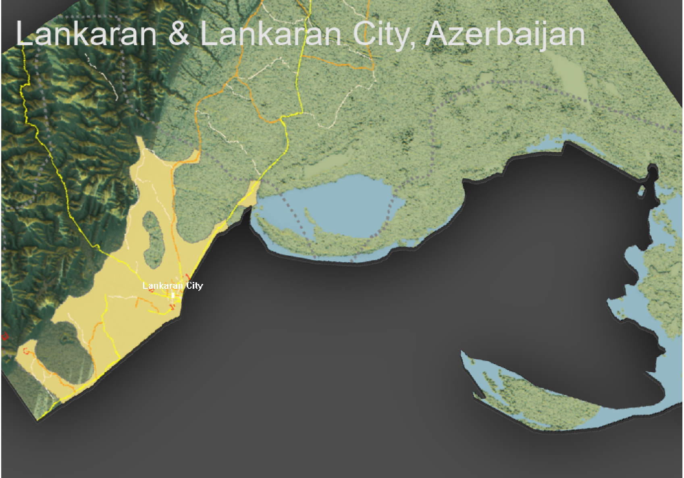

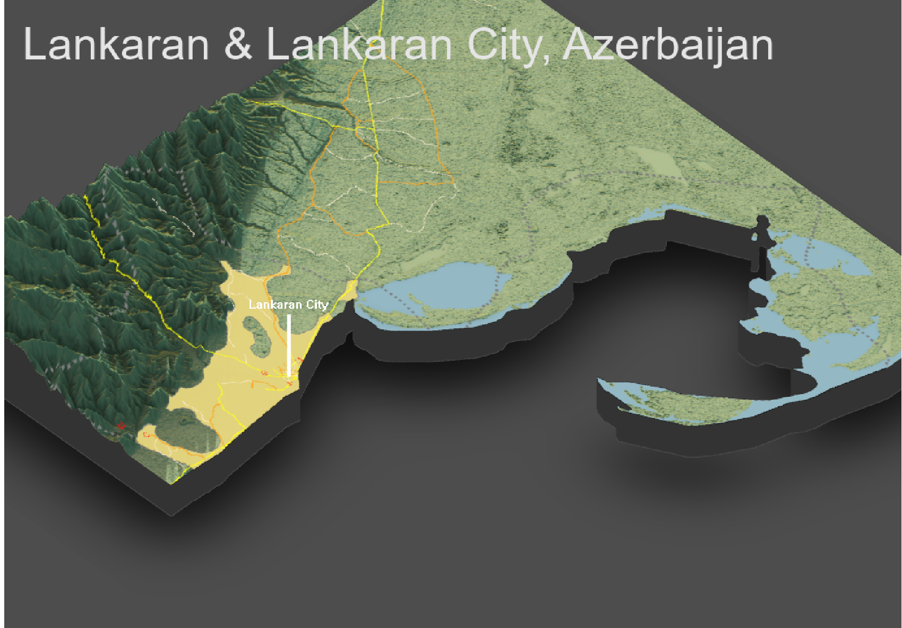

From the plots, also with previous ones, it can be interpreted that topography has strong influence on **urban areas** in _Lankaran_ and _Lankaran City_. The populated areas concentrated in the costal plane between the Caspian Sea and the inland mountainous regions, where the terrain makes infrastructural constructions and economic development more convenient. The boundaries of the urban area are basically in consistent with the base of mountains and the coastline. Lying in the optimal place of settlement, the urban areas consists of about 57.03% of the total population while only covering 17.91% of total areas. The result is high urban population density of 709.86 people per quared kilometer, more than 3 times than the average density of total population.

Besides, the distribution of road network also shows such influence. Roads, especially primary and secondary roads, mostly lie in the plane, and in mountainous areas roads tend to stretch along valleys. In general, road density is high in the plane, where most of the residents are.

In addition, the 2-dimensional plot provides more clear information on road network and healthcare facilities:

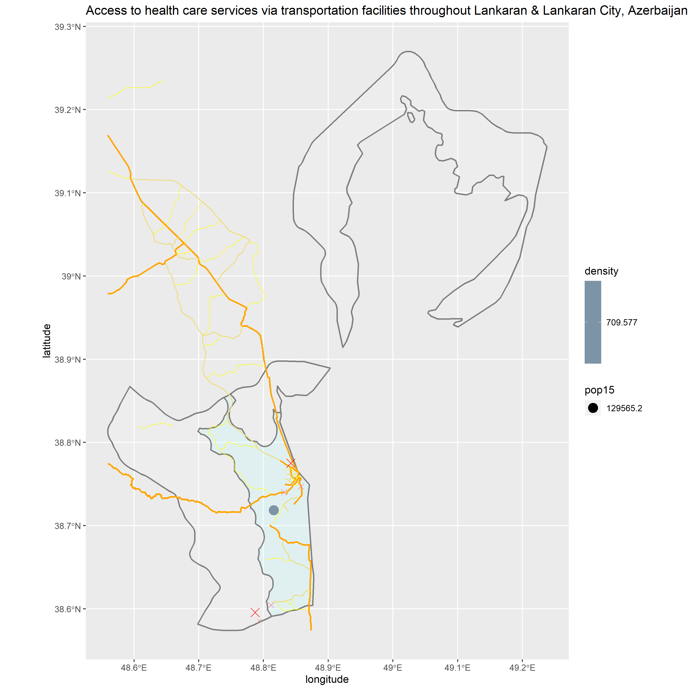

As can be seen, one of the two hospitals and two of the three pharmacies are located near the most populous central urban area, which is reasonable. However, one hospital, one pharmacy, and one place with label “doctors” (possibly a clinic) appear to be off the center of another smaller urbanized area in the south. Actually, the hospital and pharmacy there even seems to be in the mountains without any primary, secondary, or tertiary roads connecting to it. Thus, the only easily accessed hospital would be likely to face a great number of patients every day, even more than the average value of 3 healthcare sites (2 hospitals and 1 clinic), which is 72,128, a very large number already.

However, based on a brief research on _Google Maps_, about 10 hospitals exist in the two adm2s, with most located in the plane and none in the place of the "southern hospital" in the mountains as is shown in the plot. Therefore, it can be concluded that _HDX_ has an error in data, and in reality, healthcare facilities are very accessible in _Lankaran_ and _Lankaran City_ for most of population, except for very few living in the nothern part of _Lakaran_, or in the moutains where no road leads to.
asd
asd
