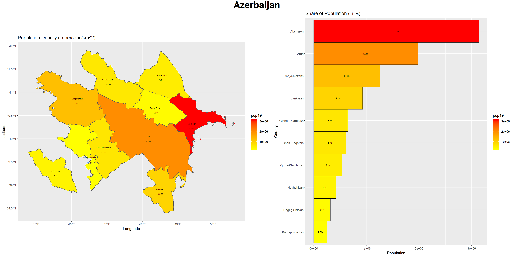
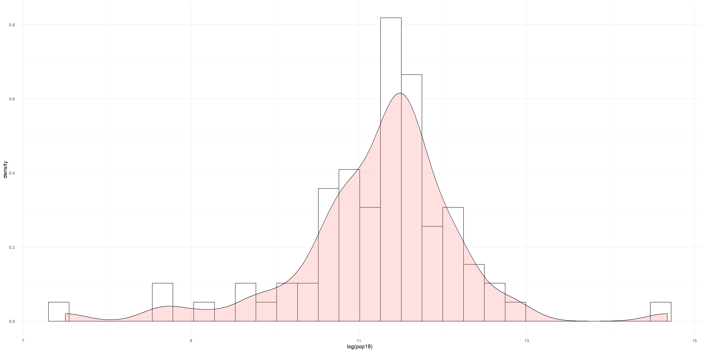

# Azerbaijan

The Republic of Azerbaijan is a country lies in the crossroads of Eastern Europe and Western Asia. In this project, this country will be described in following aspects: **political subdivisions** and **population distribution**. In addition, two administrative subdivisions--**_Lankaran District_** and **_Lankaran City_** will be examined in **population distribution**, **distributions of human settlements**, and its relation to **road networks** and **healthcare facilities**.

## Political Subdivisons

Azerbaijan has **10 _first level administrative subdivisons_ (adm1)** and **79 _second level administrative subdivisons_ (adm2)**, and the subdivsions **_Lankaran District_** and **_Lankaran City_** are located in the Southeast Corner of _Lankaran_ (adm1), which also lies in the Southeast of the country, on the West coast of Caspian Sea and bordering Iran, as is shown in the following plots:

###### (Note that in this plot and following desription the adm2 **_Lankaran District_** will be simplified as **_Lankaran_**.)

It is worth mentioning that **_Lankaran_** consists of 2 parts and one large island in the East, whose boundary is incorporated into the the adm boundary, and **_Lankaran City_** locates in the trapzoidal "gulf" on the Eastern boundary in the Southern part.

## Population Distribution (Azerbaijan)

### Population

According to data from _Humanitarian Data Exchange_ (HDX), the total population of Azerbaijan in 2019 is 10,115,498 (10 million). And population distribution on amd2 level is presented in the following plot:

The 3-dimensional versions of the plot:

The population comparison on adm1 level and the the share of population of adm2s within each adm1:

Based on these plots it can be observed that the population in almost all adm2s are rather similar except for in adm1 _Absheron_. There, the population is exceptionally larger and among the four adm2s in the adm1, Baku City--the Capital--has much larger population than any other amd2s. It is reasonable that the capital is the most economically developed area in the country and thus has the largest population, and the large total population in surrounding adm2s could be explained by satellite cities with provide housing urban populations, and the influence and expansion of the urban area and economies in the capital.

### Density, Nighttime Lights, and Correlations

Based on the following plots, density seems to more or less follow a positive correlation with population on the adm1 level, that larger popluation seems to indicate higher density:

However, on the adm2 level, the correlation between density and population seems different:

As can be seen in the overlaps of the _histogram_ and the _probability density function_ (pdf) of density and the logarithm of population (in which case makes the plot more interpretable), the density reaches its maximum long before the log(pop19) does. Such outcome could be caused be the large areas of populous adm2s (such as _Baku City_ and _Lankaran_) or 

