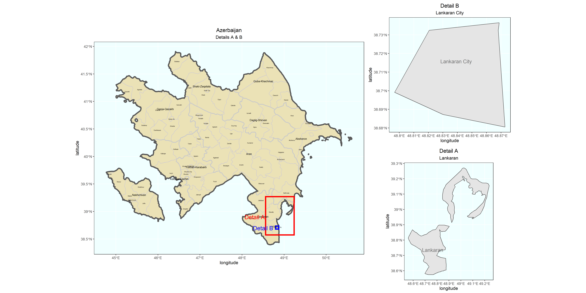
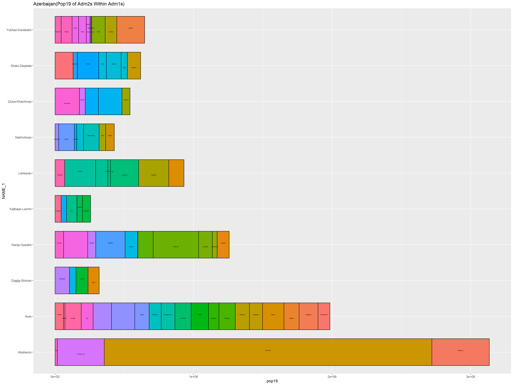

# Azerbaijan

The Republic of Azerbaijan is a country lies in the crossroads of Eastern Europe and Western Asia. In this project, this country will be described in following aspects: **political subdivisions** and **population distribution**. In addition, two administrative subdivisions--**_Lankaran District_** and **_Lankaran City_** will be examined in **population distribution**, **distributions of human settlements**, and its relation to **road networks** and **healthcare facilities**.

## Political Subdivisons

Azerbaijan has **10 first level administrative subdivisons (adm1)** and **79 second level administrative subdivisons (adm2)**, and the subdivsions **_Lankaran District_** and **_Lankaran City_** are located in the Southeast Corner of _Lankaran_ (adm1), which also lies in the Southeast of the country, on the West coast of Caspian Sea and bordering Iran, as is shown in the following plot:

###### (Note that in this plot and following desription the adm2 **_Lankaran District_** will be simplified as **_Lankaran_**.)

It is worth mentioning that **_Lankaran_** consists of 2 parts and one large island in the East, whose boundary is incorporated into the the adm boundary, and **_Lankaran City_** locates in the trapzoidal "gulf" on the Eastern boundary in the Southern part.

## Population Distribution (Azerbaijan)

According to data from _Humanitarian Data Exchange_ (HDX), the total population of Azerbaijan in 2019 is 10,115,498 (10 million). And population distribution on amd2 level is presented in the following plot:

The population comparison on adm1 level and the the share of population of adm2s withing each adm1:

